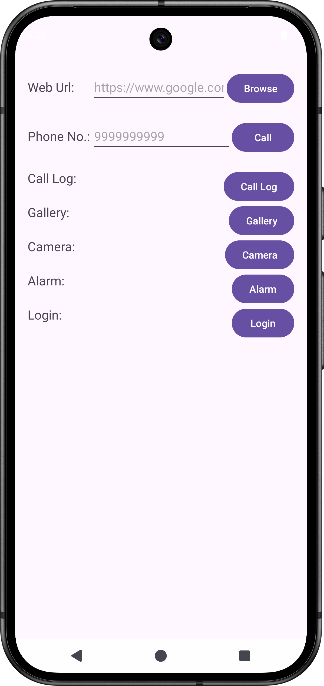

# Practical-3: Implicit & Explicit Intents Demonstration

##  Project Overview
This Android application demonstrates both **implicit** and **explicit** Intents by enabling the following functionalities directly from the app:

1. Make a call to a specific phone number
2. Open a specific URL in the browser
3. Open the call log
4. Open the gallery to view images
5. Set an alarm
6. Open the camera
7. Navigate to a Login Activity (explicit Intent)

---

##  Core Concepts Covered
- **Intents**: Differentiating between implicit and explicit intents
- **Intent Actions**: Using system-defined and custom actions
- **Data & Type Handling**: Using `Intent.setData()`, `Intent.setType()`
- **Permissions**:
    - Phone/CALL permission
    - Camera and storage access
- **URI Handling**: Parsing URIs, using MIME types
- **Activity Results & Contracts**: Using `ActivityResultContracts` for modern result handling
- **Layouts**: Using `ConstraintLayout` and `CoordinatorLayout`
- **Manifest Declarations**: Registering activities, defining intent filters where needed

---

##  Table of Contents
1. [Setup Instructions](#setup-instructions)
2. [Functionalities & Flow](#functionalities--flow)
3. [Permissions Guide](#permissions-guide)
4. [Project Structure](#project-structure)
5. [Screenshots](#screenshots)
6. [Further Notes](#further-notes)

---

##  Setup Instructions
1. Clone or download the project repository.
2. Open the project in **Android Studio**.
3. Build the project—ensure required permissions are granted for each function.
4. Run the app on a real device or emulator with necessary capabilities (e.g., camera, dialer).
5. Test each button to confirm the proper action (calls dialer, browser opens, etc.).

---

##  Functionalities & Flow
| Feature             | Type of Intent | Purpose                              |
|---------------------|----------------|--------------------------------------|
| Make Call           | Implicit       | Launch phone dialer with number      |
| Open URL            | Implicit       | Open browser with specified URL      |
| View Call Log       | Implicit       | Open the call log screen             |
| Open Gallery        | Implicit       | Launch gallery app                   |
| Set Alarm           | Implicit       | Open alarm setup                      |
| Open Camera         | Implicit       | Launch camera app                    |
| Login Activity      | Explicit       | Navigate within app to login screen  |

---

##  Permissions Guide
- **CALL_PHONE** – needed to make a call
- **READ_CALL_LOG** – to view the call log
- **READ_EXTERNAL_STORAGE** (or **READ_MEDIA_IMAGES** on newer APIs) – to access gallery
- **CAMERA** – to launch the camera
- **SET_ALARM** – potentially needed to set alarms, depending on API
- Use `ContextCompat.checkSelfPermission()` and `ActivityCompat.requestPermissions()` to handle runtime permissions.

---

##  Project Structure
```
app/
├── src/
│   └── main/
│       ├── java/com/.../
│       │   ├── MainActivity.kt       (Buttons & Implicit Intent logic)
│       │   └── LoginActivity.kt      (Explicit Intent target)
│       └── res/
│           ├── layout/
│           │   ├── activity_main.xml
│           │   └── activity_login.xml
│           ├── drawable/             (Icons or other assets)
│           └── AndroidManifest.xml   (Permissions, activities)
└── README.md
```

---

##  Screenshots
Below are example screenshots demonstrating app functionalities:

<p float="left">
  
  
</p>

---

##  Further Notes
- Always check and request permissions **just in time**, before invoking the respective action.
- Use **`ActivityResultContracts`** for safer result handling, especially for camera and gallery results.
- Ensure graceful degradation if permissions are denied or features aren’t supported (e.g., camera not available).
- Make your **LoginActivity** user-friendly—validate inputs and show errors/toasts if fields are empty.
